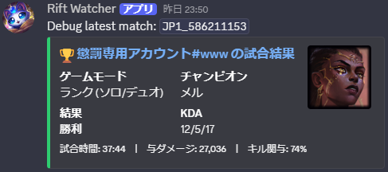

# Rift Watcher



Rift Watcher は、League of Legends の指定プレイヤーを Discord で監視するための Bot です。

監視対象のプレイヤーが試合を開始すると Discord に通知し、試合終了後は同じメッセージを自動で試合結果に更新します。結果メッセージには勝敗、KDA、チャンピオン、試合時間、与ダメージ、キル関与率などをコンパクトに表示します。

## 主な機能

- Riot ID とリージョンを指定して監視対象を登録
- 登録済みプレイヤーの試合開始を定期チェック
- 試合開始時に Discord へ embed 通知
- 試合終了後、開始通知メッセージを試合結果へ自動更新
- 試合結果タイトルから DeepLoL の詳細ページへ移動
- チャンピオンアイコン付きの見やすい結果表示
- 表示調整用に、直近の対戦履歴から結果メッセージを確認できるデバッグコマンドを搭載
- 通常運用では静かな CLI ログ、必要な時だけ DEBUG ログを表示

## 必要なもの

- Python 3.10 以上
- Discord Bot Token
- Riot Games API Key

Discord Bot Token は [Discord Developer Portal](https://discord.com/developers/applications) から取得します。
Riot Games API Key は [Riot Developer Portal](https://developer.riotgames.com/) から取得します。

## セットアップ

1. リポジトリを取得します。

```bash
git clone https://github.com/KamiGamix/Rift_Watcher.git
cd Rift_Watcher
```

2. 仮想環境を作成して有効化します。

Windows:

```powershell
python -m venv venv
.\venv\Scripts\activate
```

macOS / Linux:

```bash
python3 -m venv venv
source venv/bin/activate
```

3. 依存パッケージをインストールします。

```bash
pip install -r requirements.txt
```

4. Bot を起動します。

```bash
python Python/main.py
```

初回起動時に `.env` が存在しない、または必要な値が不足している場合は、ターミナル上で `DISCORD_TOKEN` と `RIOT_API_KEY` の入力を求められます。入力された値はプロジェクトルートの `.env` に保存されます。

```ini
DISCORD_TOKEN="Your Discord Bot Token"
RIOT_API_KEY="Your Riot Games API Key"
```

## Discord コマンド

| コマンド | 説明 | 引数 | 例 |
| --- | --- | --- | --- |
| `/summonerset` | 監視対象のサモナーを登録・更新します。 | `riot_id`, `region` | `/summonerset riot_id:Faker#KR1 region:KR` |
| `/summonerremove` | このチャンネルの監視リストからサモナーを削除します。 | `riot_id` | `/summonerremove riot_id:Faker#KR1` |
| `/summonerslist` | このチャンネルで監視中のサモナー一覧を表示します。 | なし | `/summonerslist` |
| `/debuglatestmatch` | 指定した Riot ID の直近試合を使って、試合結果メッセージを表示します。表示デザインの確認に使います。 | `riot_id`, `region`, `public` | `/debuglatestmatch riot_id:Faker#KR1 region:KR public:false` |

`/debuglatestmatch` は通常、自分だけに見える ephemeral メッセージとして表示されます。`public:true` を指定すると、チャンネルに公開表示できます。

## 対応リージョン

`BR1`, `EUN1`, `EUW1`, `JP1`, `KR`, `LA1`, `LA2`, `NA1`, `OC1`, `TR1`, `RU`, `PH2`, `SG2`, `TH2`, `TW2`, `VN2`

## 試合結果メッセージ

試合終了後の embed には以下の情報を表示します。

- Riot ID
- 勝敗
- ゲームモード
- 使用チャンピオン
- KDA
- 試合時間
- 与ダメージ
- キル関与率
- チャンピオンアイコン

タイトルは DeepLoL の試合詳細ページにリンクしています。

## ログ

通常のコンソールログは、運用時に見やすいよう短く抑えています。

詳細ログを確認したい場合は、起動前に `RIFT_CONSOLE_LOG_LEVEL` を設定してください。

Windows PowerShell:

```powershell
$env:RIFT_CONSOLE_LOG_LEVEL='DEBUG'
python Python/main.py
```

macOS / Linux:

```bash
RIFT_CONSOLE_LOG_LEVEL=DEBUG python Python/main.py
```

ログファイルは `rift_watcher.log` に出力されます。実行時に生成される `db.sqlite`、ログファイル、Python キャッシュは Git 管理対象外です。

## データ保存

監視対象と追跡中の試合情報は SQLite の `db.sqlite` に保存されます。

古い `db.json` が存在する場合は、起動時に SQLite へ自動移行され、移行後の元ファイルは `db.json.bak` にリネームされます。

## 開発メモ

表示メッセージの調整を行う場合は、実際の監視ループを待たずに `/debuglatestmatch` を使うと確認しやすくなります。

```text
/debuglatestmatch riot_id:確認したいRiotID#TAG region:JP1 public:false
```

## ライセンス

MIT License です。詳細は [LICENSE](LICENSE) を確認してください。
